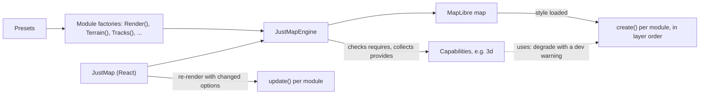

<a href="https://github.com/justAnArthur/just-map"></a>

# just-map

A modular 3D map library on MapLibre GL JS — Swiper-style composition of domain modules
(render, terrain, data, animation, navigation), React-first with a vanilla escape hatch.
Extracted from the maplibre-trips-demo spike with every default battle-tested there.

```bash
npm install @justanarthur/just-map maplibre-gl react
```

## Use

```tsx
import { JustMap } from '@justanarthur/just-map/react'
import { Render } from '@justanarthur/just-map/modules/render'
import { Terrain, Buildings } from '@justanarthur/just-map/modules/terrain'
import { Tracks } from '@justanarthur/just-map/modules/data'
import { Playback, FollowCam } from '@justanarthur/just-map/modules/animation'
import { Gestures } from '@justanarthur/just-map/modules/navigation'
import 'maplibre-gl/dist/maplibre-gl.css'

<JustMap
  modules={[
    Render({ provider: 'satellite', dim: true }),
    Terrain({ exaggeration: 1.8 }),          // provides capability "3d"
    Buildings(),
    Tracks({ data, colorBy: { property: 'speed', palette: 'viridis' } }),
    Playback({ follow: true }),
    FollowCam({ pitch: 60 }),
    Gestures({ rotate3d: { speed: 0.3 } }),   // rotate3d needs "3d"
  ]}
  camera={{ pitch: 68, projection: 'globe' }}
/>
```

Or one preset (`googleEarth`, `flat`, `history`, `realtime`):

```tsx
import { presets } from '@justanarthur/just-map/presets'

<JustMap {...presets.googleEarth({ terrain: { exaggeration: 2 } })} />
```

The [library README](packages/just-map/README.md) has the full API: every module and its options,
the vanilla engine, theming, presets and GPS road snapping (`@justanarthur/just-map/matching`).

## How it works

Each module is a factory that returns its definition plus options. `JustMapEngine` (wrapped by
`<JustMap>` in React) checks every module's `requires`, collects what it `provides` (`Terrain` → `3d`),
creates the MapLibre map, and once the style is live calls each module's `create()` in array order,
which is layer order. A re-render diffs the options per module and calls its `update()`, so
map-type switches and sliders don't remount the map.



## Develop

```sh
bun install
bun run build       # builds packages/just-map (tsup, ESM + d.ts)
bun run test        # bun:test unit tests
bun run typecheck

cd examples/basic && bun dev   # each example is a standalone Vite app (ports 5191-5196)
```

## Structure

```
packages/just-map     the library (see its README for the full API)
examples/basic        styling playground: map/hybrid/satellite + base styles + tweaks + 3D
examples/playground   kitchen sink: every module, toggle/slider per option
examples/gps-matching raw GPS breadcrumbs vs road-snapped routes (OSRM /match)
examples/outdoor      terrain-first: globe, big exaggeration, mountain track
examples/fleet        live, fleet overview (vehicles, zones, pins) and history tracking
examples/zones        geofence editing + point markers (flat 2D)
```

## Releases

Versioning, npm publishing and GitHub releases run via
[just-github-actions-n-workflows](https://github.com/justAnArthur/just-github-actions-n-workflows)
(`bump-version`, `publish-npm-on-tag`, `release-on-tag`). Conventional commits with the `map`
scope bump the package (`feat(map): …`); pushing a `@justanarthur/just-map@x.y.z` tag
publishes to npm and cuts the release.

## License

[MIT](LICENSE)
